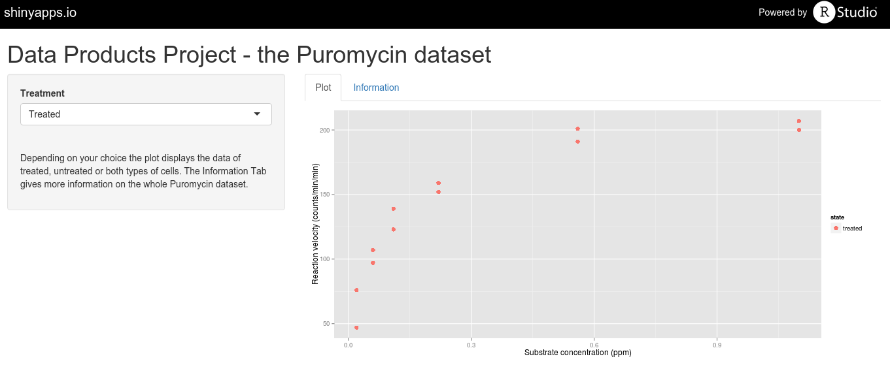

## The Puromycin dataset

- holds data on the velocity of an enzymatic reaction with and without Puromycin
- was measured by Treloar in 1974 [1]

```{r}
str(Puromycin)
```

[1] Treloar, M. A. (1974), Effects of Puromycin on Galactosyltransferase in Golgi Membranes, M.Sc. Thesis, U. of Toronto.

--- 

## The shiny app

A shiny app was created that allows some insight into the Puromycin dataset. It is available on shinyapps.io:

<a href="https://silviabahmann.shinyapps.io/DataProductsProject">Shiny app</a>



---

## Plot tab

The user may choose the category of the data ("treated", "untreated", "both") which changes the data points shown in the plot.

```{r echo = FALSE, message=FALSE, fig.height=4, fig.width=10}
library(ggplot2)
ggplot(Puromycin, aes(x = conc, y = rate, colour = state)) + 
        geom_point(size = 3) + 
        xlab("Substrate concentration (ppm)") +
        ylab("Reaction velocity (counts/min/min)")
```

---

## Information tab

Furthermore, there is a tab with some more information on the Puromycin dataset including a summary of the dataset.

```{r}
summary(Puromycin)
```


